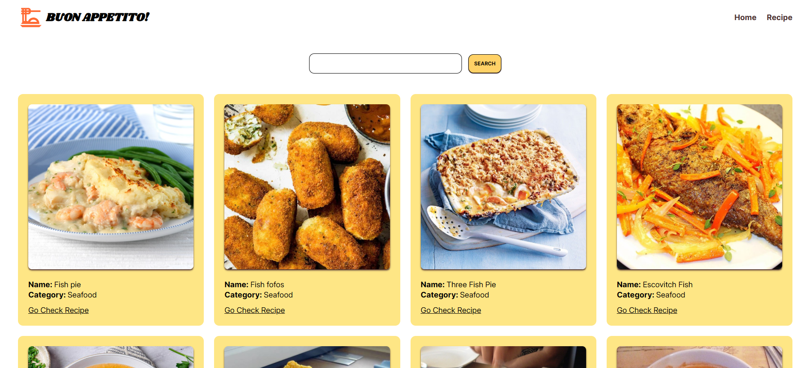

# react-recipe

> A clean and responsive Recipe Search application built using **React**, **TypeScript**, and **Tailwind CSS**.

## Table of contents

- [react-recipe](#react-recipe)
  - [Table of contents](#table-of-contents)
  - [General info](#general-info)
  - [Screenshots](#screenshots)
  - [Technologies](#technologies)
  - [Code Examples](#code-examples)
  - [Features](#features)
  - [To-do list](#to-do-list)
  - [Status](#status)
  - [Contact](#contact)

## General info

**React Recipe Search** is a user-friendly app that allows users to search for recipes by typing in keywords.  
It uses the [TheMealDB API](https://www.themealdb.com/) to fetch recipe data and display it with a modern and responsive UI.  
This project demonstrates best practices in React development with TypeScript, Tailwind CSS, and `react-router-dom` for navigation and loader-based data fetching.

## Screenshots



## Technologies

- React
- TypeScript
- Tailwind CSS
- React Router DOM (v6+)
- TheMealDB API
- Visual Studio Code

## Code Examples

Using a loader function to fetch and return recipe data with TypeScript:

```ts
interface RecipeType = {
  idMeal: string;
  strMeal: string;
  strInstructions: string;
  strMealThumb: string;
};

type RecipeAPIResponse = {
  meals: RecipeType[]
}

export const recipeLoader: LoaderFunction = async ({ params }) => {
  const { recipeId } = params;
  const data = await fetchRecipe(recipeId) as RecipeAPIResponse;
  return data?.meals[0];
};

```

## Features

- Search for recipes using keywords
- View detailed recipe instructions and images
- Routing with react-router-dom (including dynamic routes)
- API integration with TheMealDB
- Accessible and responsive design
- Type-safe API handling with TypeScrip

## To-do list

- Add category or cuisine filters

## Status

Project is: done

## Contact

By [boba-milktea](https://github.com/boba-milktea)
